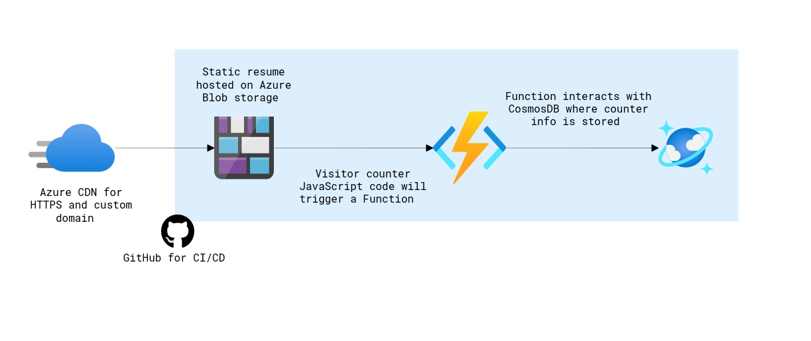
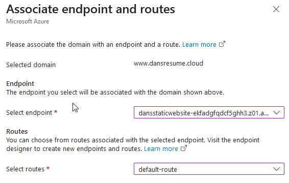
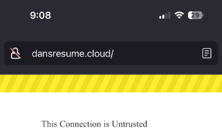
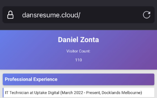
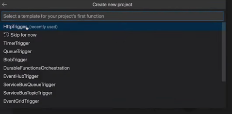
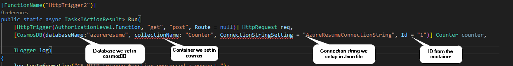
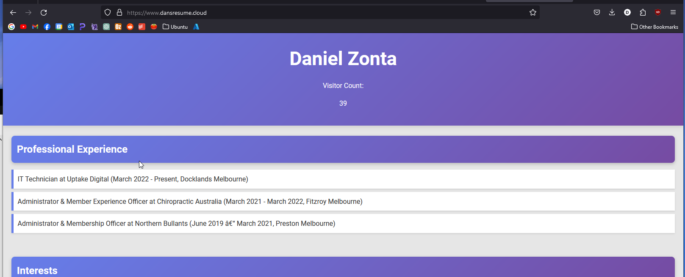
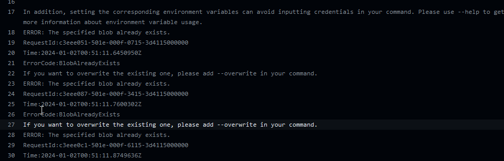
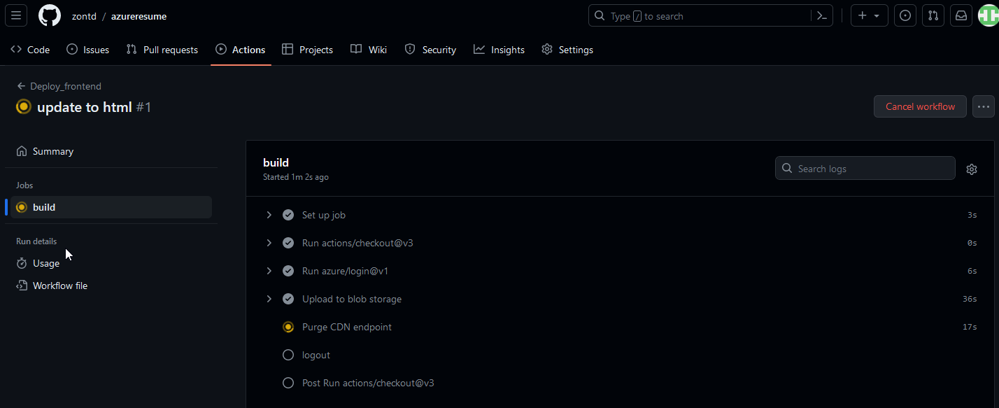

## Introduction

Hi there! I've been working on the IT helpdesk for over a year now. To keep growing professionally, I've decided to delve into learning about the different areas in IT. I’m currently working on a homelab but I needed a different project to sink my teeth into while I work on that. With so many fields to choose from I took a stab and chose cloud with the [Cloud Resume Challenge](https://cloudresumechallenge.dev/). For those not familiar, the aim of the cloud resume challenge is to build and deploy a static website using either Azure, AWS or Google Cloud service, I chose Azure.



When I started looking into the challenge, I enjoyed the way the creator, Forrest Brazeal,  discussed it on a [reddit post](https://www.reddit.com/r/devops/comments/vyzvju/build_something_real_the_cloud_resume_challenge/?share_id=biS5M-wOGjdwmsRjkt4ZN&utm_content=1&utm_medium=ios_app&utm_name=ioscss&utm_source=share&utm_term=1). According to them, the aim of the challenge was to “lay out a spec that would require people to open a bunch of search tabs, stay up late and go down rabbit holes”. As my intention was to mainly get a taste of the cloud, for the programming parts I followed Gwyneth’s (GPS) [guide](https://www.youtube.com/watch?v=ieYrBWmkfno). Following the guide didn’t spare me from the fate of having 50 tabs open at once though.


## Starting out


To start, Chat GPT and I didn’t have much of an issue creating a website with HTML and CSS, I fed it my resume, prompted it for a trendy resume website and proceeded to upload it into a blob container. 

Following that, I set up a DNS zone, switched my nameservers to Azure, and established a CDN for https://www.dansresume.cloud/. This setup enabled me to secure the site with HTTPS.



## Certbot

My initial challenge in troubleshooting came from an unexpected issue that really annoyed me. I discovered that Azure doesn't provide SSL certificates for Apex domains. This meant that my apex domain (domain without www.) [dansresume.cloud](https://dansresume.cloud/), was accompanied with that unsightly 'insecure' padlock icon, which drove me up the wall.

To fix this, I used my Ubuntu server to generate my own SSL certificate following this [guide](https://www.xyb.name/2020/07/10/enable-https-and-root-domain-on-azure-cdn/). After generating the cert, Azure kept on spitting out an RSA error. After a bit of digging, a legend on the [lets encrypt forum](https://community.letsencrypt.org/t/getting-a-rsa-privkey-from-the-letsencrypt-generated-pem/188797/16) suggested using “--key-type rsa” when generating my certificate which allowed the upload to work.

 


> Note: The Lets Encrypt Cert only lasts 3 months so I have since taken the resume site off of Azure and parked it on Github pages as I don’t see myself re-veryfying it every 3 months. I’ll most likely add a visitor count to this blog instead. 

## Databases and Functions

Ok, now I can breathe, imagine having that annoying warning popup whenever someone would navigate to my root domain, the horror!

With the site live and HTTPS working, it was time to explore the mythical backend of the cloud. My first step was setting up the CosmosDB database. This posed several challenges, as concepts like Row Key and Partition Key were new to me. Little did I realise, this was just the tip of the iceberg.

After some researching I found I could then create the HTTP function through the VS code app, this was honestly awesome. I had originally set it up through the Azure interface but thought it’d be more fun to set it up there.



## Putting it together

With the function database and website created, It was time to connect them all. I started my research into bindings, triggers NoSQL, API’s and so fourth. It was at this moment I realised how in over my head I was.


After a couple of hours of research and asking chat gpt to explain concepts and snippets of code to me like a 5 year old, I decided it was time to call in the big guns. I booted up GPS's guide from here on out and followed it. The guide was relatively straightforward however given it being outdated by 2 years it still involved my own troubleshooting. For example, the commands used in the guide required additional installs. Whilst following, I enjoyed taking snippets of the code and understanding what meant what.



I encountered a snag where the “ConnectionStringSetting” wasn’t being recognised. A bit of investigation revealed that the guide’s attributes were outdated. I needed to use the current ones, which I found in Microsoft’s documentation [here](https://learn.microsoft.com/en-us/azure/azure-functions/functions-bindings-cosmosdb-v2-output?pivots=programming-language-csharp&tabs=python-v2%2Cin-process%2Cnodejs-v4%2Cfunctionsv2#attributes). After the HTTP trigger was configured, I connected the javascript to my HTML and uploaded the new versions to Azure. It was working at last! 

```html
   <script src="js/modernizr.js"></script>
   <script src="main.js"></script>
</head>
<body>
    <header>
        <h1>Dan Zonta</h1>
        <p>Visitor Count: <span id="visitCount"></span></p><p><a id="counter"></a></p>        
```


## CI/CD Pipeline

I could finally taste the end of this project,I was pretty happy to see my project working but wanted to build the CI/CD pipeline. This was crucial as it would enable me to update the webpage without having to directly edit within the storage account.

There were a few things that went wrong whilst undertaking this stage. Even when following the guide on and off there was troubleshooting to be done such as looking into error codes and trying solutions out. After looking at documentation from various sources, adjusting for error codes such as trying the overwrite function was one of the solutions.



```yaml
        inlineScript: |
            az storage blob upload-batch --account-name dansstorage123 --auth-mode key -d '$web' -s frontend --overwrite
    - name: Purge CDN endpoint
      uses: azure/CLI@v1
      with:
        inlineScript: |
```
After some trial and error, the elation when I saw the CI/CD start running and tick everything off, It felt good not going to lie.




## Learnings
1. The Cloud is awesome and you can build some neat things on it
2. Github makes development infinitely more efficient and streamlined
3. API’s are a great tool for getting websites to talk to each other securely
4. If you want your API to be secure, don’t leak your API key, which can overlooked as a beginner. I definetly didn't do that 👀
5. Coding is a pivotal part of developing in the cloud.
6. Fight and Win!  

## Finishing up

Lastly, I actually need a place to put this blog, I was thinking of Medium or Wordpress but because I’m in the mood to deploy things and I don’t want to pay for hosting, I'm going to use a static site generator. You should fine a blog about that soon 🙂
