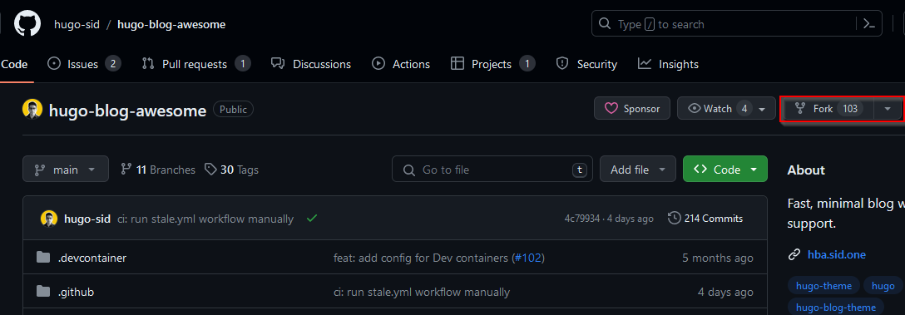
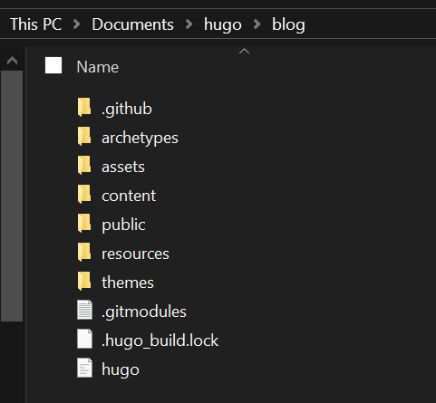
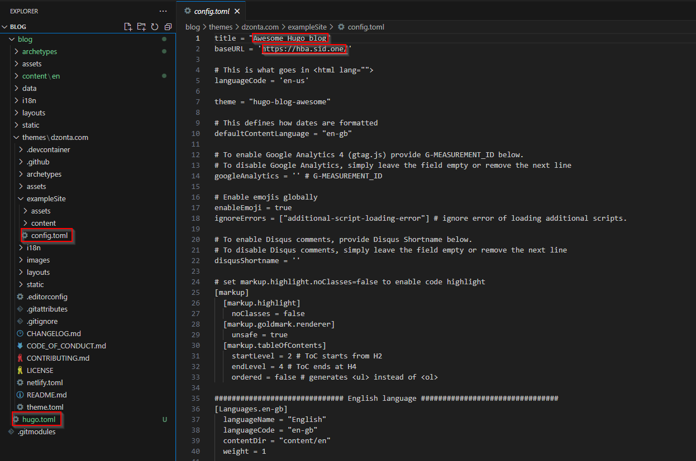

## Introduction

Hello Hello! As I got to the end of writing my first post about the cloud resume challenge, I realised I had no idea where to put my blogs. I thought that I may as well blog about this process and It can double up as a guide for anyone else that would like to do it too.


As I started thinking about where I wanted to post, I jotted down a criteria that i wanted it to have:

1. Super fast
2. Not vulnerable
3. Easy to update (CI/CD)
4. Free
5. Custom domains 

There were some restrictions for using the free tier blogs on medium and wordpress such as no custom domain so I was put off by those websites. I also wanted a blog that loaded super fast and would allow me to implement some CI/CD (continuous integration and continuous deployment) which I learned in the cloud project. Lastly i wanted some i didn’t have to constantly patch and fix up.

You might suggest building your own website with HTML and CSS but ain’t nobody got time for that. After a little research I stumbled upon something that ticked all the boxes. The solution / unicorn I found was a static site generator. A SSG is a tool that generates a static html website off of the raw data you feed it. Once you know how to use it, it’s straightforward and fun.

So if you’re interested in making your own blog, feel free to have a read. I'll go over the core concepts and my learnings plus it may give you the kick start to make your own blog too. 

## Welcome to Hugo

So which Static site generator did I choose? Hugo ofcourse! There actually wasn’t too much rhyme or reason, Hugo was just more accessible on Windows, has great themes and user base.

> Before getting underway, feel free to follow along, I’ll place the key points on what I did and link to documentation where need be.


## Requirements 

- [Code editor](https://code.visualstudio.com/)
- [Git](https://git-scm.com/book/en/v2/Getting-Started-Installing-Git) 
- [A Github account](https://github.com/)
- [Chocolatey](https://chocolatey.org/install)

## Steps

Here are the key steps that I took to get this up and running.

1. Installed Hugo

```powershell
choco install hugo-extended
```
2. Found a [Hugo theme](https://themes.gohugo.io/) that I liked and forked its repository to my github.

>Forking creates a completely independent copy of the Git repository.



3. Created a second repository on my github account named “blog”, cloned that down to my device and generated a static site in that repository. I then cut the contents of the generated hugo site and placed them into the main blog folder.

> It needed to be done this way so that the Hugo files were in the main branch of the repository.

```powershell
cd documents/hugo/
Git clone https://github.com/zontd/blog.git
cd /blog
Hugo new site blog
```



4. Used `git submodule add` command in the themes directory of the newly generated hugo site.

> You can find a good guide on this [here](https://www.andrewhoog.com/post/git-submodule-for-hugo-themes/). It also does a good job explaining why the git submodule needed to be used instead of cloning directly.

5. I copied the contents of the example sites TOML file across to my newly generated TOML and edited the content to suit my site



> A TOML file is a simple way to store configuration data for programs, similar to other formats like JSON or YAML. It’s kind of similar to going into your INI files and editing them for skyrim and fallout. Try and find a theme that comes with a pre-configured TOML file so you can look at how they’ve set it up.

6. Created my first page using the hugo new content command e.g hugo new content posts/my-first-post.md


> This will create a folder and a markdown file for you. It will also generate the starter text for you. Hugo will separate your pages by the folders you generate. Therefore you need to keep your posts in one folder and about me in a separate one. It should look something like the below.

```html
content/about-us/index.md
content/contact-us/index.md
content/posts/post1.md
content/posts/post2.md
```

> You can read more on creating pages [here](https://gohugo.io/getting-started/quick-start/) 
7. Generated my site using the Hugo command in the root directory of the site.

```powershell
cd hugo/blog/
Hugo
```
8. Lastly, I created a workflow in github. I did this by following [this short guide](https://gohugo.io/hosting-and-deployment/hosting-on-github/)

## End

Thank you for having a read, feel free to reach out on Linkedin if you would like to chat or have any crituques, I'm always open to optimising this for other learners.


